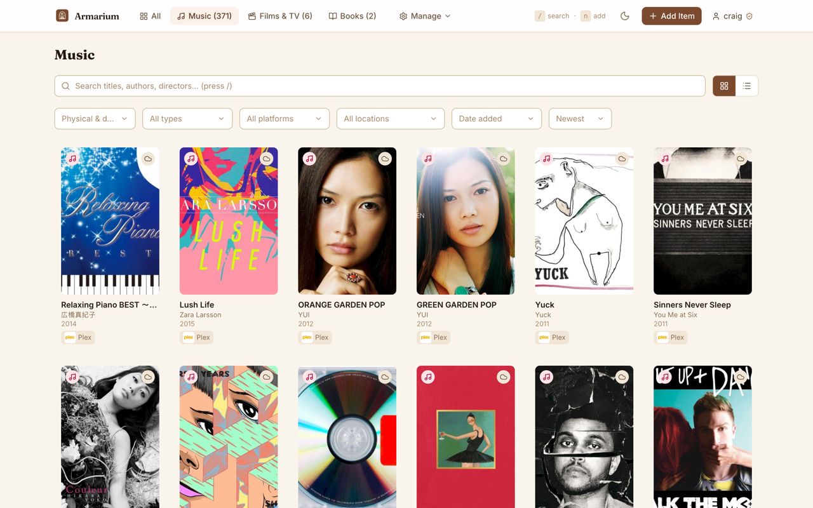
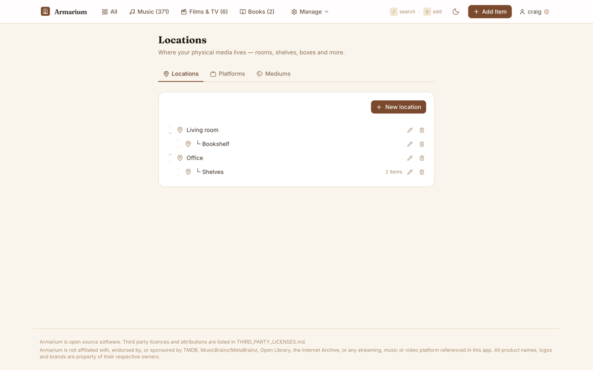
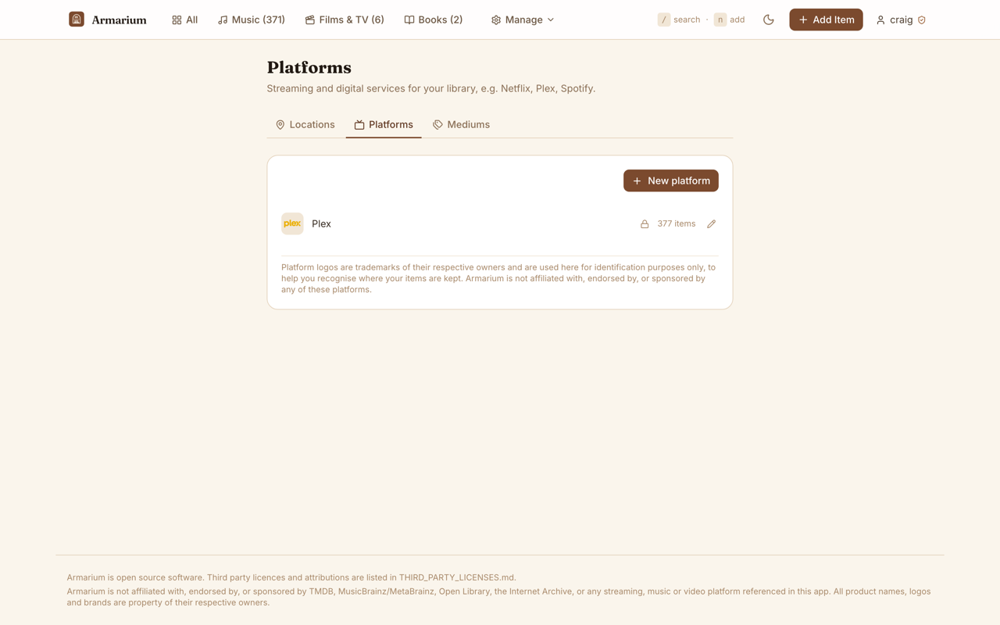
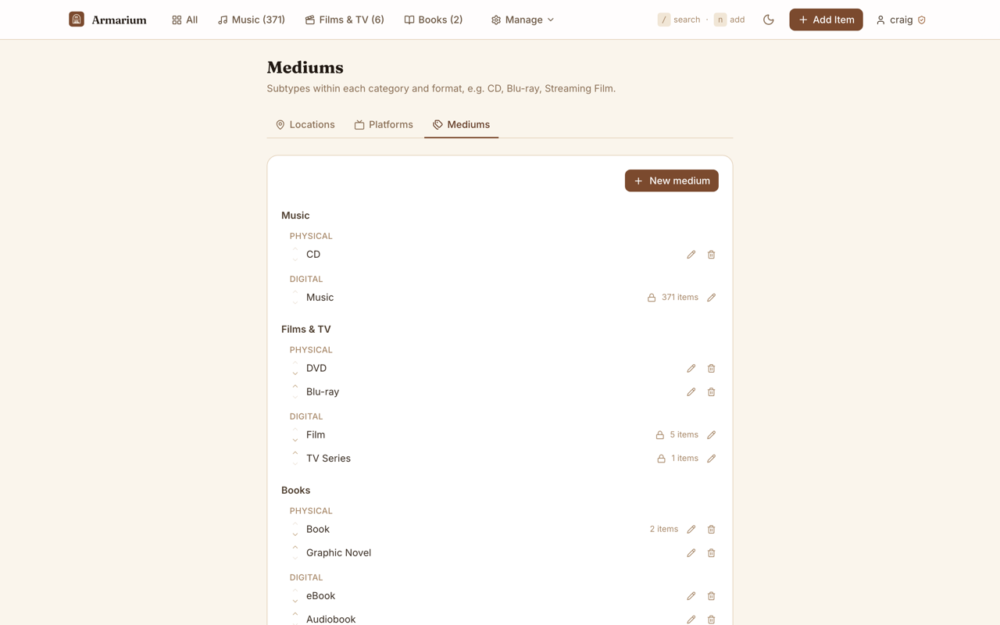
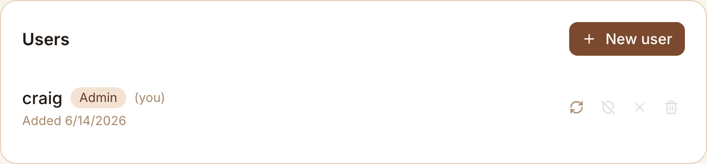

# Armarium

[](https://github.com/craig530/Armarium/actions/workflows/ci.yml)
[](LICENSE)
[](https://armarium.app)

**Armarium is a self-hosted catalogue for your media collection.** Keep track of
every CD, vinyl record, DVD, Blu-ray, book, graphic novel — and the streaming
services and digital storefronts you use too — all in one searchable,
browsable library that lives on your own hardware.

It's built for people who collect physical media but also use digital
platforms, and want one place to answer "do I already own this, and where is
it?"

**Project website:** [armarium.app](https://armarium.app) — feature overview,
screenshots, and self-hosting information. The source repository will be made
public shortly.

## What's in a name?

In medieval monasteries, the *armarium* was the cupboard — often built into
the cloister wall near the scriptorium — where monks kept their books and
manuscripts. The monk responsible for it, the *armarius*, was effectively the
librarian: cataloguing the collection, tracking what was where, and making
sure nothing went missing.

This project borrows the name for the same job, just with CDs and Blu-rays
instead of illuminated manuscripts.

## Screenshots

|                                                 |                                                   |
| ----------------------------------------------- | ------------------------------------------------- |
|  |  |
| Library grid view, with search, filters and sorting | Locations manager — model your home as a nested tree of rooms, shelves and boxes |
|  |  |
| Platforms manager — track digital storefronts and streaming services, including synced sources like Plex | Mediums manager — customise the physical/digital media types within each category |
|  |  |
| Admin panel — manage multiple users with granular per-user permissions |  |

## Features

- **One library, every format** — catalogue Music, Films & TV, and Books,
  whether you own them physically or digitally.
- **Physical and digital, linked together** — pair a Blu-ray with its digital
  copy (or a CD with a streaming version) so they show up as a single entry
  with an ownership badge. Armarium can detect and link matching titles
  automatically.
- **Barcode scanning** — use your phone or laptop camera to scan a barcode and
  pull up matching results instantly.
- **Automatic metadata and cover art** — titles, artwork, release years, genres
  and more are fetched from [TMDB](https://www.themoviedb.org/),
  [MusicBrainz](https://musicbrainz.org/) and [Open Library](https://openlibrary.org/).
- **Plex library sync** — connect a Plex Media Server and import your Films &
  TV and Music libraries as digital items, with per-library media-type
  mapping, progress tracking, and cleanup of items removed from Plex.
- **Track where things live** — organise physical items into a hierarchy of
  locations (shelves, boxes, rooms) with custom icons, and digital items by
  the platform they're on (with platform logos).
- **Curated lists** — group items into your own named lists within each
  category (e.g. "Want to read", "Favourites"), assignable from any item's
  form and filterable from the library views.
- **Fast search and filtering** — full-text search across your whole
  collection, plus filters by category, type, location, platform, list, genre
  and year.
- **Multi-user with admin roles** — secure JWT-based login, with an admin
  panel for managing additional user accounts.
- **Export and import** — back up or migrate your library as CSV or JSON.
- **Automatic backups** — scheduled and on-demand backups of your catalogue,
  with old backups pruned automatically.
- **Installable as an app (PWA)** — add Armarium to your phone's home screen
  and browse your library offline.
- **Dark mode** and **keyboard shortcuts** for fast, comfortable browsing.
- **Fully customisable** — add, rename or reorder media types, locations,
  platforms and lists to match your own collection from the Settings area.

## Tech Stack

| Layer | Technology |
|---|---|
| Backend | [FastAPI](https://fastapi.tiangolo.com/) (Python 3.11), [SQLAlchemy 2.0](https://www.sqlalchemy.org/) (async) |
| Database | [SQLite](https://www.sqlite.org/) by default — [PostgreSQL](#advanced-using-postgresql) also supported |
| Frontend | [React 19](https://react.dev/), [Vite](https://vitejs.dev/), [Tailwind CSS 4](https://tailwindcss.com/), [Zustand](https://github.com/pmndrs/zustand) |
| Auth | JWT access tokens ([python-jose](https://github.com/mpdavis/python-jose)) with [bcrypt](https://github.com/pyca/bcrypt) password hashing |
| Containerisation | [Docker](https://www.docker.com/) & [Docker Compose](https://docs.docker.com/compose/) — non-root containers, multi-stage builds |

## Quick Start

### Prerequisites

- [Docker](https://docs.docker.com/get-docker/) and the
  [Docker Compose plugin](https://docs.docker.com/compose/install/)
  (both are included with Docker Desktop on macOS and Windows).

### 1. Clone the repository

```bash
git clone https://github.com/craig530/Armarium.git
cd Armarium
```

### 2. Configure environment variables

```bash
cp .env.example .env
```

Open `.env` in a text editor and set at least:

- `JWT_SECRET` — a random secret used to sign login sessions. Generate one
  with `openssl rand -hex 32`.
- `ADMIN_PASSWORD` — the password for the admin account that's created the
  first time Armarium starts.

See [Configuration](#configuration) below for every available option.

### 3. Start Armarium

```bash
docker compose up -d
```

This builds and starts the backend and frontend containers. The first start
may take a minute or two while images are built and the database is
initialised.

### 4. Open the app

Visit **http://localhost:8080** (or whichever port you set with `PORT` in
`.env`) and log in with the admin username and password from your `.env`
file. You can create additional user accounts from the admin panel.

## Configuration

All configuration is set via environment variables in `.env` (copied from
`.env.example`). **Never commit your `.env` file** — it contains secrets and
is already excluded via `.gitignore`.

| Variable | Required | Default | Description |
|---|---|---|---|
| `JWT_SECRET` | **Yes** | *(none)* | Secret key used to sign authentication tokens. Generate with `openssl rand -hex 32`. If left unset, a random secret is generated on each startup, which logs everyone out whenever the container restarts. |
| `ADMIN_PASSWORD` | **Yes** | *(none)* | Password for the initial admin account, created automatically the first time Armarium starts (only if no users exist yet). |
| `ADMIN_USERNAME` | No | `admin` | Username for the initial admin account. |
| `PORT` | No | `8080` | The port on your host machine that the web UI is served on. |
| `JWT_EXPIRE_MINUTES` | No | `10080` (7 days) | How long a login session stays valid, in minutes, before you need to log in again. |
| `TMDB_API_KEY` | No | *(none)* | Free API key from [TMDB](https://www.themoviedb.org/settings/api), needed for Films & TV metadata lookup. Without it, Music and Books lookup still work. |
| `DATABASE_URL` | No | `sqlite+aiosqlite:///./data/armarium.db` | Database connection string. Defaults to a SQLite file stored in the persistent data volume. See [Advanced: Using PostgreSQL](#advanced-using-postgresql) to use a different database. |
| `CORS_ORIGINS` | No | *(same-origin only)* | Comma-separated list of extra origins allowed to call the API directly. Not needed for the default setup, where the frontend and backend share an origin via the bundled reverse proxy. |
| `COOKIE_SECURE` | No | `true` | Whether the browser login session cookie requires HTTPS. Only set to `false` for HTTP-only deployments (e.g. an internal network without TLS) — otherwise the browser won't send the cookie back and login won't work. |

## Supported Media Types

Armarium organises items into three categories, each covering both physical
and digital formats. These are the defaults created the first time you start
Armarium — you can rename, reorder, or add your own from **Settings → Media
Subtypes**.

| Category | Physical | Digital |
|---|---|---|
| **Music** | CD | Digital Music, Streaming Music |
| **Films & TV** | DVD, Blu-ray, 4K Blu-ray | Digital Film, Digital TV Series, Streaming Film, Streaming TV |
| **Books** | Book, Graphic Novel | — |

## Metadata Sources

Armarium looks up titles, cover art and other details from these free
third-party services:

| Category | Source | API key needed? |
|---|---|---|
| Films & TV | [The Movie Database (TMDB)](https://www.themoviedb.org/) | Yes — see [Configuration](#configuration) |
| Music | [MusicBrainz](https://musicbrainz.org/) | No |
| Books | [Open Library](https://openlibrary.org/) | No |

This product uses the TMDB API but is not endorsed or certified by TMDB.

## API Documentation

The backend automatically generates interactive API documentation (Swagger
UI) from its OpenAPI schema, available at `/docs` once the backend is
running — for example `http://localhost:8000/docs` in local development.

In the default production setup the backend isn't exposed directly to the
host, so `/docs` isn't reachable from outside the Docker network. To browse
it, either run the [development setup](#hot-reload-docker-setup) below, or
temporarily publish port `8000` on the `backend` service in
`docker-compose.yml`.

All endpoints other than `/api/v1/auth/login` require authentication. The
browser SPA authenticates via an `httpOnly` session cookie set automatically
on login. API clients (curl, scripts) instead use the `access_token` returned
in the login response body as a `Bearer` token — see the
[import/export examples](#exporting-and-importing-your-library) below.

## Usage

### Keyboard shortcuts

| Key | Action |
|---|---|
| `/` | Focus search |
| `n` | Go to Add Item |
| `g` | Switch to grid view |
| `l` | Switch to list view |
| `Esc` | Go back |

### Installing as an app (PWA)

Armarium is a Progressive Web App, so it can be installed and used like a
native app, including offline browsing of your library:

- **iOS (Safari):** tap **Share → Add to Home Screen**.
- **Android / desktop Chrome:** open the browser menu and choose
  **Install app**.

> Service workers (and therefore the offline/installable features) require
> HTTPS. If you're accessing Armarium over plain HTTP on your local network,
> these features may not be available until you put a TLS-terminating reverse
> proxy in front of it.

### Exporting and importing your library

Any user can export their library from the user menu as **CSV** or **JSON**.

Importing is restricted to admin accounts and is done via the API:

```bash
# Log in to get a token
TOKEN=$(curl -s -X POST http://localhost:8080/api/v1/auth/login \
  -H "Content-Type: application/json" \
  -d '{"username":"admin","password":"your-password"}' | jq -r .access_token)

# Import a CSV file
curl -X POST "http://localhost:8080/api/v1/library/import?format=csv" \
  -H "Authorization: Bearer $TOKEN" \
  -F "file=@my-library.csv"
```

CSV column headers must match the export format, but column order doesn't
matter.

### Backups

From the **admin panel**, click **Backup now**, or trigger one via the API:

```bash
curl -s -X POST http://localhost:8080/api/v1/library/backup \
  -H "Authorization: Bearer $TOKEN"
```

Backups are stored inside the `app_data` volume under `data/backups/`. The 30
most recent backups are kept automatically.

To back up everything (database, covers, uploaded icons/logos and backups) in
one go, snapshot the whole volume:

```bash
docker run --rm -v armarium_app_data:/data -v "$(pwd)":/backup alpine \
  tar czf /backup/armarium-$(date +%Y%m%d).tar.gz /data
```

## Releases & versioned deployments

Tagged versions (`vX.Y.Z`) are published as prebuilt Docker images on the
[GitHub Container Registry](https://github.com/craig530?tab=packages), so you
can run a specific version without cloning the repo or building anything
locally — useful for production hosts or pinning to a known-good version. See
[docs/DEPLOYMENT.md](docs/DEPLOYMENT.md) for full instructions, including a
ready-to-use `docker-compose.prod.yml`. Release notes for each version are in
[CHANGELOG.md](CHANGELOG.md).

## Development

For a full walkthrough of setting up a local development environment —
including VS Code on macOS/Linux, running the backend and frontend test
suites, and using [Claude Code](https://claude.com/claude-code) with this
repo's conventions — see [docs/DEVELOPMENT.md](docs/DEVELOPMENT.md). The quick
version:

### Running locally without Docker

```bash
# Backend
cd backend
python -m venv .venv && source .venv/bin/activate
pip install -r requirements.txt
JWT_SECRET=dev ADMIN_PASSWORD=devpass uvicorn app.main:app --reload

# Frontend (in a separate terminal)
cd frontend
npm install
npm run dev
# → http://localhost:3000
```

### Hot-reload Docker setup

A development Compose override is provided for hot-reloading both the backend
and frontend inside containers:

```bash
docker compose -f docker-compose.yml -f docker-compose.dev.yml up
```

This does **not** run automatically — it must be requested explicitly with
the `-f` flags above, so it's never accidentally used in production.

### Running tests

```bash
cd backend
pip install -r requirements.txt
pytest -v
```

## Advanced: Using PostgreSQL

Armarium uses SQLite by default, which needs no extra setup and is a great
fit for most self-hosted deployments. If you'd prefer PostgreSQL:

1. Add a database service to `docker-compose.yml`:

   ```yaml
   services:
     db:
       image: postgres:16-alpine
       restart: unless-stopped
       environment:
         POSTGRES_DB: armarium
         POSTGRES_USER: armarium
         POSTGRES_PASSWORD: ${DB_PASSWORD:-changeme}
       volumes:
         - pg_data:/var/lib/postgresql/data
       healthcheck:
         test: ["CMD-SHELL", "pg_isready -U armarium"]
         interval: 10s
         retries: 5

   volumes:
     pg_data:
   ```

2. Set `DATABASE_URL` in `.env`:

   ```
   DATABASE_URL=postgresql+asyncpg://armarium:changeme@db:5432/armarium
   ```

   The `asyncpg` driver is included in the backend image already, so no
   rebuild is needed for this step.

3. Make the `backend` service depend on `db` with
   `condition: service_healthy`.

4. Restart: `docker compose up -d`.

## Project Structure

```
armarium/
├── backend/                  FastAPI + SQLAlchemy (async) + SQLite/PostgreSQL
│   ├── app/
│   │   ├── api/v1/             auth, users, media, locations, media-subtypes,
│   │   │                        platforms, lookup, library export/import, plex
│   │   ├── models/              User, MediaItem, MediaSubtype, Location,
│   │   │                        Platform, ItemLink, PlexConfig, ...
│   │   ├── schemas/             Pydantic request/response schemas
│   │   ├── repositories/        per-model data-access layer (all SQL lives here)
│   │   └── services/            auth, metadata lookups (TMDB/MusicBrainz/
│   │                            Open Library), cover art, search, Plex sync,
│   │                            rate limiting
│   ├── alembic/                 migration environment (0001_baseline = v1 schema)
│   └── tests/                   pytest test suite (119+ tests)
├── frontend/                  React 19 + Vite + Tailwind CSS
│   ├── src/
│   │   ├── api/                 API client (cookie-based auth, 401 redirect)
│   │   ├── components/          UI, layout, media cards, barcode scanner,
│   │   │                        add-item flow, settings management
│   │   ├── pages/                Library, Add Item, Item Detail, Settings, Admin, Login
│   │   ├── hooks/                keyboard shortcuts, etc.
│   │   └── store/                 Zustand stores (auth, theme, library UI state)
│   └── public/                    PWA manifest, service worker, icons
├── docs/
│   ├── DEVELOPMENT.md          Local dev environment setup (VS Code, Mac/Linux)
│   └── DEPLOYMENT.md           Deploying versioned releases with Docker
├── .github/workflows/          CI (lint/SAST/tests) and release (image build/publish)
├── docker-compose.yml           Production: builds backend + frontend from source
├── docker-compose.prod.yml      Production: prebuilt images from a tagged release
├── docker-compose.dev.yml       Development override: hot reload for both
├── ARCHITECTURE.md               Architecture & conventions reference
├── CLAUDE.md                     Instructions for Claude Code / AI assistants
└── .env.example                  Template for your local configuration
```

## Credits & Attribution

Armarium relies on these free metadata services:

- **[TMDB](https://www.themoviedb.org/)** — Films & TV metadata and artwork.
  This product uses the TMDB API but is not endorsed or certified by TMDB.
- **[MusicBrainz](https://musicbrainz.org/)** — music metadata, courtesy of
  the [MetaBrainz Foundation](https://metabrainz.org/).
- **[Open Library](https://openlibrary.org/)** — book metadata and cover art,
  a project of the [Internet Archive](https://archive.org/).

It's also built on [FastAPI](https://fastapi.tiangolo.com/),
[SQLAlchemy](https://www.sqlalchemy.org/), [React](https://react.dev/),
[Vite](https://vitejs.dev/), [Tailwind CSS](https://tailwindcss.com/) and many
other open-source packages. Built-in location icons come from
[Lucide](https://lucide.dev/), and built-in platform logos are extracted from
[simple-icons](https://github.com/simple-icons/simple-icons).

See [THIRD_PARTY_LICENSES.md](THIRD_PARTY_LICENSES.md) for the full list of
dependencies, their licences, and attribution details for the services and
brand assets above.

> Armarium is an independent project and is **not affiliated with, endorsed
> by, or sponsored by** TMDB, MusicBrainz/MetaBrainz, the Internet
> Archive/Open Library, or any streaming, music or video platform it can
> connect to (Plex, Netflix, Spotify, etc.). All product names, logos and
> trademarks are the property of their respective owners.

## Contributing

Contributions, bug reports and feature suggestions are very welcome — see
[CONTRIBUTING.md](CONTRIBUTING.md) for how to get started and
[docs/DEVELOPMENT.md](docs/DEVELOPMENT.md) for a full local setup guide
(including VS Code and [Claude Code](https://claude.com/claude-code)).
[ARCHITECTURE.md](ARCHITECTURE.md) and [CLAUDE.md](CLAUDE.md) document the
project's architecture and conventions — read these before making structural
changes (new models, routers, repositories, stores, migrations, etc.).

## License

Armarium is released under the [MIT License](LICENSE).

Third-party dependencies, fonts, icons, and external API attributions are
listed in [THIRD_PARTY_LICENSES.md](THIRD_PARTY_LICENSES.md).
